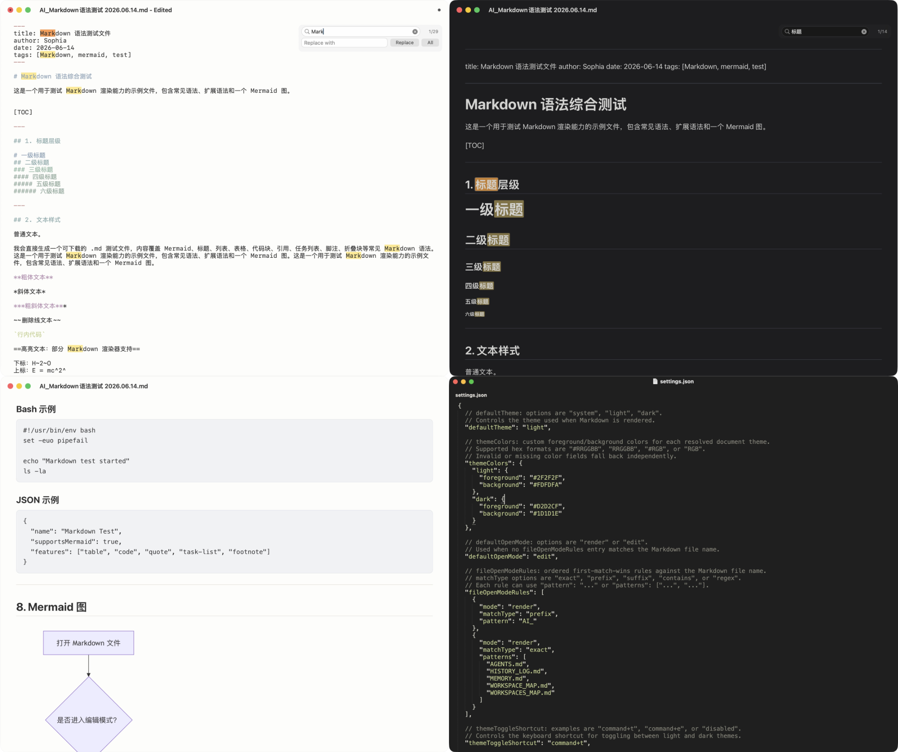

# Mini.md

A tiny, native Markdown reader and editor for macOS.

Mini.md is designed for people who want Markdown files to open instantly into a clean reading window without toolbars, sidebars, Dock clutter, or editor noise. It provides a polished preview mode, a lightweight source editor, Mermaid diagram rendering, Quick Look previews, search, find-and-replace, configurable themes, and simple Markdown/keyword highlighting.



## Highlights

- **Minimal macOS interface** — document-first windows with native traffic-light controls and no persistent Dock icon.
- **Preview and edit in one window** — switch between rendered Markdown and source editing with `Command+E`.
- **Mermaid support** — render fenced `mermaid` diagrams directly inside Markdown files.
- **Quick Look extension** — preview Markdown files from Finder with the Space bar.
- **Fast local rendering** — a compact Swift Markdown renderer backed by `WKWebView`; bundled CSS and Mermaid resources work without relying on a web service.
- **Search and replace** — case-insensitive search in preview/edit mode; literal, case-sensitive replacement in edit mode.
- **Light and dark themes** — follow the system theme or choose a fixed theme; customize foreground and background colors.
- **Configurable highlighting** — color Markdown structures, inline spans, and literal keywords through `~/Mini.md/highlight.json`.
- **HTML export** — export the current Markdown file to a styled `.html` file with `Command+Shift+E`.

## Supported Markdown features

Mini.md intentionally focuses on the Markdown features most useful for everyday technical notes and reports:

- Headings `#` through `######`
- Paragraphs and horizontal rules
- Blockquotes
- Ordered and unordered lists
- Task list checkboxes
- Tables with left, center, and right alignment
- Fenced code blocks
- Mermaid fenced blocks
- Inline code
- Bold, italic, and strikethrough text
- Links and images

Mini.md is not intended to be a full CommonMark compliance testbed. It is a pragmatic renderer for clean local reading and quick edits.

## Installation

### From a release build

1. Download the latest release archive.
2. Move `Mini.md.app` to `/Applications`.
3. Open it once. If macOS blocks the first launch for an unsigned local build, right-click the app and choose **Open**.
4. To make it the default Markdown app, select a `.md` file in Finder, open **Get Info**, set **Open with** to Mini.md, then choose **Change All…**.

### Quick Look

Mini.md includes a Quick Look extension for Markdown files. After installing or replacing the app, Finder may need a refresh before the Space-bar preview uses the new extension:

```bash
qlmanage -r
qlmanage -r cache
```

## Usage

Open any `.md`, `.markdown`, `.mdown`, or `.mkdn` file with Mini.md. The app opens supported Markdown files directly and ignores unsupported file types.

| Shortcut | Action |
| --- | --- |
| `Command+E` | Toggle between preview mode and edit mode |
| `Command+S` | Save edits in edit mode |
| `Command+F` | Search in the current document |
| `Command+Option+F` | Open find-and-replace in edit mode |
| `Return` in search field | Jump to the next match |
| `Return` in replacement field | Replace the current match |
| `Esc` | Close the search bar |
| `Command+R` | Reload the current file from disk |
| `Command+T` | Toggle light/dark theme |
| `Command+=` / `Command+-` | Zoom in / zoom out |
| `Command+0` | Reset preview zoom |
| `Command+Shift+E` | Export the current document as HTML |
| `Command+P` | Print the current document |
| `Command+,` | Open `settings.json` |
| `Control+Tab` | Switch to the next tab when tabs are enabled |

When leaving edit mode with unsaved changes, Mini.md asks whether to save, discard, or cancel. The window title also shows an edited state while the source buffer differs from the file on disk.

## Configuration

Mini.md stores user configuration in:

```text
~/Mini.md/settings.json
~/Mini.md/highlight.json
```

Both files are created automatically on first launch. They are JSON files that may contain full-line `//` comments.

### `settings.json`

`settings.json` controls app behavior, theme selection, shortcuts, default open mode, zoom, tabs, highlighting switches, and HTML export settings.

Example:

```jsonc
{
  "defaultTheme": "system",
  "themeColors": {
    "light": {
      "foreground": "#25292E",
      "background": "#FBFAF7"
    },
    "dark": {
      "foreground": "#EFEAD8",
      "background": "#252525"
    }
  },
  "defaultOpenMode": "render",
  "fileOpenModeRules": [
    { "mode": "render", "matchType": "prefix", "pattern": "AI_" },
    {
      "mode": "render",
      "matchType": "exact",
      "patterns": ["AGENTS.md", "HISTORY_LOG.md", "MEMORY.md", "WORKSPACE_MAP.md"]
    }
  ],
  "titlebarVisible": true,
  "themeToggleShortcut": "command+t",
  "refreshShortcut": "command+r",
  "defaultRenderZoom": 1.0,
  "defaultEditZoom": 1.0,
  "editSyntaxHighlightingEnabled": true,
  "renderSyntaxHighlightingEnabled": false,
  "htmlExport": {
    "defaultZoom": 1.0,
    "contentWidthPX": 980,
    "printMarginMM": 8
  },
  "zoomInShortcut": "command+=",
  "zoomOutShortcut": "command+-",
  "singleInstancePerFile": true,
  "rememberWindowFrame": true,
  "rememberContentZoom": true,
  "tabsEnabled": false,
  "keepAliveAfterLastWindowClosed": false,
  "keepAliveIdleTimeoutSeconds": 300
}
```

Supported file-open rule match types are `exact`, `prefix`, `suffix`, `contains`, and `regex`. Rules are evaluated in order, and the first match wins.

### `highlight.json`

`highlight.json` controls the colors used by Mini.md's simple Markdown and keyword highlighter. Enable or disable highlighting for edit/render mode in `settings.json`.

Supported Markdown keys:

- `heading1` through `heading6`
- `unorderedList`
- `orderedList`
- `quote`

Supported inline keys:

- `quotedText`
- `boldText`
- `inlineCode`

Keyword rules are literal and case-sensitive. A `keyword` scope colors only the matched text. A `line` scope colors the whole source line in edit mode and the nearest rendered block in preview mode.

Example:

```jsonc
{
  "light": {
    "markdown": {
      "heading1": "#0B57D0",
      "heading2": "#5E35B1",
      "heading3": "#00796B",
      "unorderedList": "#7A4D00",
      "orderedList": "#7A4D00",
      "quote": "#188038"
    },
    "inline": {
      "quotedText": "#A142F4",
      "boldText": "#B06000",
      "inlineCode": "#0B57D0"
    },
    "keywords": [
      { "keyword": "ERROR", "scope": "line", "color": "#B00020" },
      { "keyword": "WARNING", "scope": "line", "color": "#B26A00" }
    ]
  },
  "dark": {
    "markdown": {
      "heading1": "#8AB4F8",
      "heading2": "#C58AF9",
      "heading3": "#81C995",
      "unorderedList": "#FDD663",
      "orderedList": "#FDD663",
      "quote": "#81C995"
    },
    "inline": {
      "quotedText": "#D7AEFB",
      "boldText": "#FFD166",
      "inlineCode": "#8AB4F8"
    },
    "keywords": [
      { "keyword": "ERROR", "scope": "line", "color": "#FF6B6B" },
      { "keyword": "WARNING", "scope": "line", "color": "#FFD166" }
    ]
  }
}
```

Markdown syntax markers that disappear after rendering, such as code-fence markers, are only visible to the edit-mode highlighter.

## Project structure

```text
src/
  Mini.md/
    AppDelegate.swift
    BrowserWindow.swift
    BrowserWindowController.swift
    MarkdownRenderer.swift
    MarkdownRenderView.swift
    MarkdownEditorView.swift
    MarkdownEditorSearchController.swift
    MarkdownHTMLExporter.swift
    SettingsManager.swift
    ThemeManager.swift
    HighlightConfiguration*.swift
    Resources/
      markdown-light.css
      markdown-dark.css
      mermaid.min.js
  MiniMDQuickLook/
    PreviewProvider.swift
outputs/
  Mini.md.app/
```

## Architecture

Mini.md is a native Swift/AppKit application with a deliberately small rendering pipeline:

- `AppDelegate` handles Markdown file opening, supported extensions, optional per-file single-instance behavior, tabs, and idle keep-alive mode.
- `BrowserWindowController` coordinates the preview/editor modes, search bar, replacement actions, themes, reloads, saves, printing, and HTML export.
- `MarkdownRenderer` converts Markdown source into HTML and injects theme CSS plus Mermaid support when needed.
- `MarkdownRenderView` displays rendered HTML in `WKWebView`, handles search highlights, zoom, printing, and external link behavior.
- `MarkdownEditorView` is the source editor built on `NSTextView`, with edit-mode search, replacement, zoom, and temporary highlight attributes.
- `MiniMDQuickLook` provides Finder Space-bar previews through a bundled Quick Look extension.

## Development

The current source snapshot is organized as a macOS app target plus a Quick Look extension target. To build from source, open the project in Xcode, make sure the app target includes `src/Mini.md` and the Quick Look target includes `src/MiniMDQuickLook`, then build the Mini.md scheme.

Current bundle metadata in this snapshot:

- App name: `Mini.md`
- Bundle identifier: `com.openai-codex.zhangzheng.minimd`
- Version: `1.11.7`
- Build: `49`
- Supported document extensions: `.md`, `.markdown`, `.mdown`, `.mkdn`
- Current deployment target in the bundled property lists: macOS `26.0` or later

If you want to support older macOS versions, lower the deployment target in Xcode and test the main app, `WKWebView` rendering, and the Quick Look extension carefully.

## Notes and limitations

- Search is case-insensitive.
- Replacement is literal and case-sensitive; regular expressions are intentionally not supported.
- The renderer covers common Markdown syntax but does not aim for full CommonMark compatibility.
- Render-mode highlighting can only color content that still exists after Markdown is converted to HTML.
- Local image paths are resolved relative to the Markdown file in the app and Quick Look preview.
